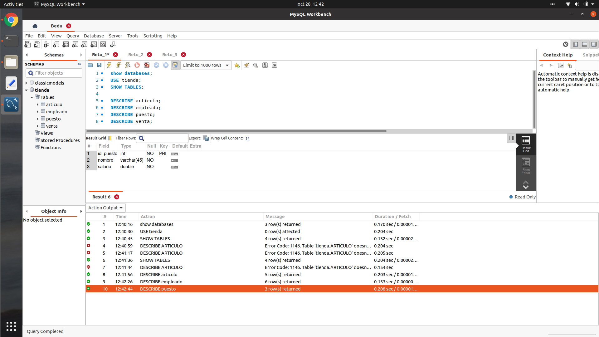

## Reto 1: Estructura de una tabla


<div style="text-align: justify;">

```sql
SHOW DATABASES;
```


```sql
USE tienda;
```


```sql
SHOW TABLES;
```


```sql
DESCRIBE articulo;
```


```sql
DESCRIBE empleado;
```


```sql
DESCRIBE puesto;
```


```sql
DESCRIBE venta;
```


| Tipo      | Descripción                   |
|-----------|-------------------------------|
| int       | Número entero, positivo o negativo, con tamaño de 4 bytes       |
| varchar   | Cadena de caracteres de longitud variable         |
| timestamp | Dato de fecha que incluye la fecha y la hora, y tiene un rango de '1970-01-01 00:00:01' UTC a '2038-01-19 03:14:07' UTC.                        |
| double    | Número flotante de presición doble |

</div>


