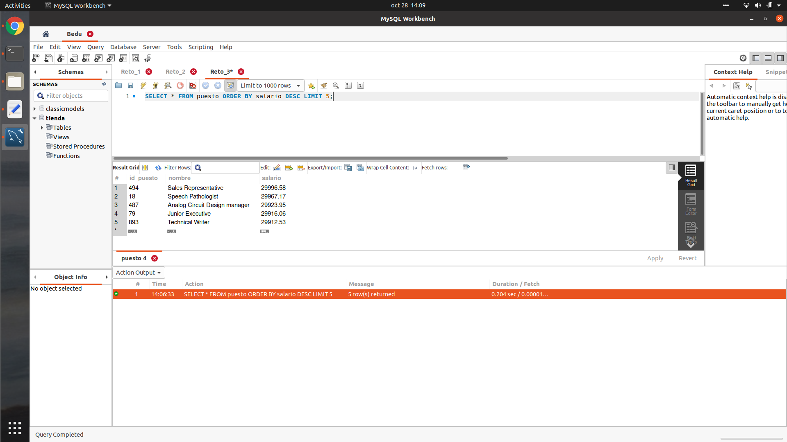

## Reto 3:


<div style="text-align: justify;">


### - Usando la base de datos tienda, escribe una consulta que permita obtener el top 5 de puestos por salarios.
```sql
SELECT * FROM puesto ORDER BY salario DESC LIMIT 5;
```



</div>


